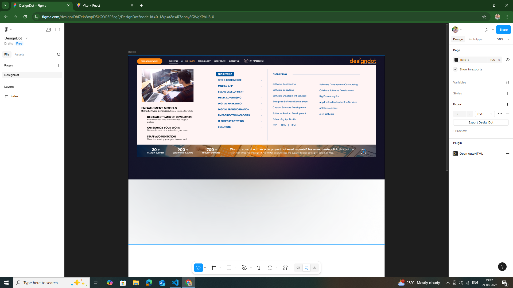
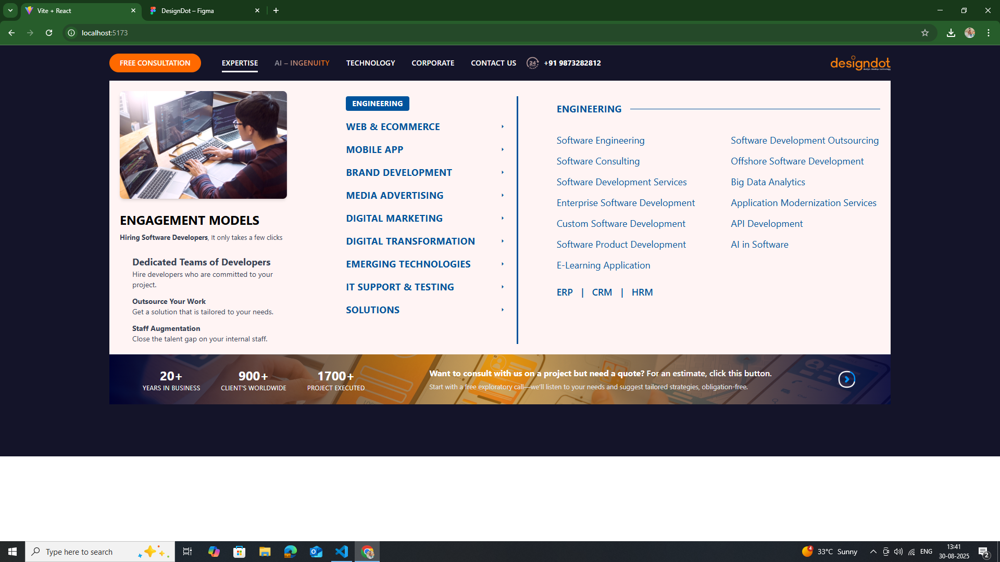

# Figma to React Conversion

This project is a **Figma to React conversion assignment**. The given Figma design was implemented into a working React application using **Vite** and **Tailwind CSS**. The main objective was to convert the static UI design into clean, reusable, and maintainable React components.

---

## 📌 Project Overview

- **Task**: Convert provided Figma design into a React website.  
- **Tech Stack**:  
  - ⚛️ React (Vite)  
  - 🎨 Tailwind CSS  
- **Approach**:  
  - Analyzed the Figma file and broke down the UI into reusable React components.  
  - Ensured pixel-perfect implementation of layout, typography, and colors.  
  - Used semantic HTML and utility-first Tailwind classes for styling.  
  - Assets such as images, logos, and icons were integrated locally as per the design.  

---

## 📂 Project Structure

```
src/
 ├── components/
 │    ├── Navbar.jsx
 │    ├── EngagementModels.jsx
 │    ├── StatsCTA.jsx
 │    
 ├── App.jsx
 ├── main.jsx
```

---

## 🎯 Features

- **Responsive design ready** (desktop-first, mobile adjustments possible).  
- **Reusable components** for sections (Navbar, Stats, Engagement Models, CTA).  
- **Pixel-perfect match** with Figma design.  
- **Fast build** with Vite + Tailwind.  

---

## 📸 Screenshots

### 🎨 Figma Design (Provided)


### ⚛️ React Output (My Implementation)


---

## 🚀 Getting Started

### 1. Clone Repository
```bash
git clone https://github.com/ParitoshBarman/Design-Dot.git
cd figma-to-react
```

### 2. Install Dependencies
```bash
npm install
```

### 3. Run Development Server
```bash
npm run dev
```

---

## 📌 Notes

- This project was created as part of an assignment.  
- Focus was on converting design into a React app with pixel-perfect accuracy.  
- Additional responsiveness and animations can be added if required.  

---

## 👨‍💻 Author
- **Paritosh Barman**  
- Built with ❤️ using React + Tailwind
